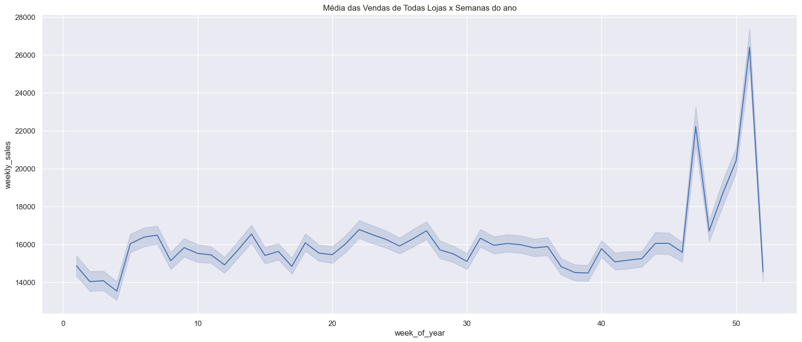

# Walmart
  

O projeto foi desenvolvido através da metodologia CRISP-DM, e ao final do primeiro ciclo de desenvolvimento foi possível responder as seguintes perguntas de négocio.

- Existe algum setor que desempenhe melhor?

O setor/departamento que desempenha melhor é de número 92, que representa em média $75204.87 em vendas semanais.

- Qual é o impacto dos feriados (promoções também) nas vendas das lojas?

## Feriados:

Os feriados que maior impactam sobre as vendas são o de Ação de Graças e de Natal, que corresponde à 21% das vendas semanais ao longo do período analisado.

## Promoções:

Observa-se que as promoções começam impactar sobre alguns dias antes de ocorrerem os feriados e durante eles.

## Machine Learning

- É possível estimar as vendas das lojas por semana em datas futuras de 2012–11–02 a 2013–07-26? Se sim, quais seriam esses valores?

|  __Faturamento (billing)__  |
|-----------------------------| 
| US$ 1.895.774.952.14        |

# Problema de Negócio:

A rede Walmart é uma empresa do ramo de varejo, que possui ao todo 45 lojas, e cada loja possui aproximadamente 99 departamentos.

Essa rede  varejista quer prever as vendas semanais futuras porque ela descobrir como o impacto financeiro influencia no desempenho do negócio e com isso determinar o sucesso e desempenho da empresa num certo período futuro.

# Premissas de Negócio:

* As features "mark_down" representa a redução em até 50% dos produtos em geral.
* Os valores negativos da feature "weekly_sales" tem um impacto de -3% sobre as vendas, o que não influencia fortemente na análise dos dados.

# Estratégia de Negócio:

Etapa 01 - Entedimento do problema de négocio.

Etapa 02 - Download do dataset diretamente do Kaggle.

Etapa 03 - Limpeza do conjunto de dados removendo valores discrepantes, valores NA e recursos desnecessários.

Etapa 04 - Exploração os dados (EDA) para criar hipóteses, gerar insights e validá-los.

Etapa 05 - Criando um modelo utilizando um algoritmo de Machine Learning.

# Conclusões:

O modelo de previsão Random Forest foi escolhido e com isso foi possível estimar as predições dentro do período estipulado.

# Melhorias Futuras:

- Adicionar novas features.
- Realizar a preparação dos dados.
- Fazer o Cross Validation
- Implantar Hiperparâmetros (Fine Tuning)
- Testar outros algoritmos de Machine Learning.
